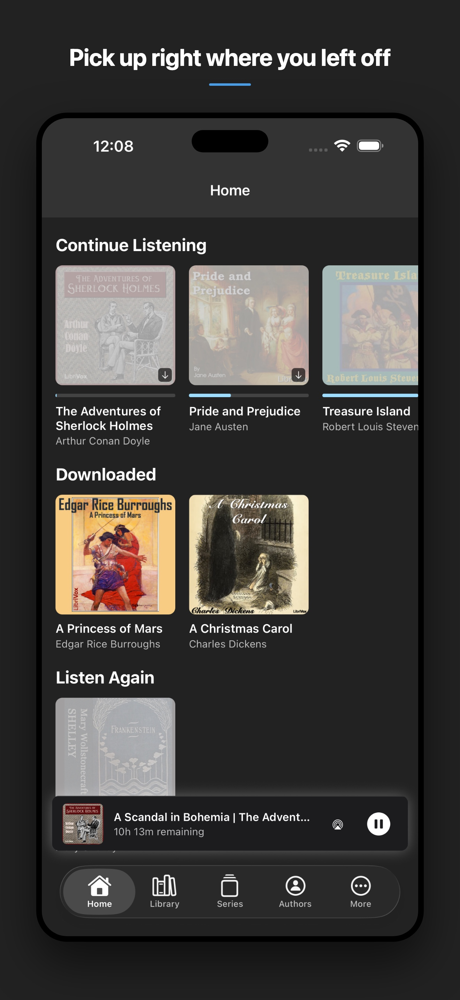
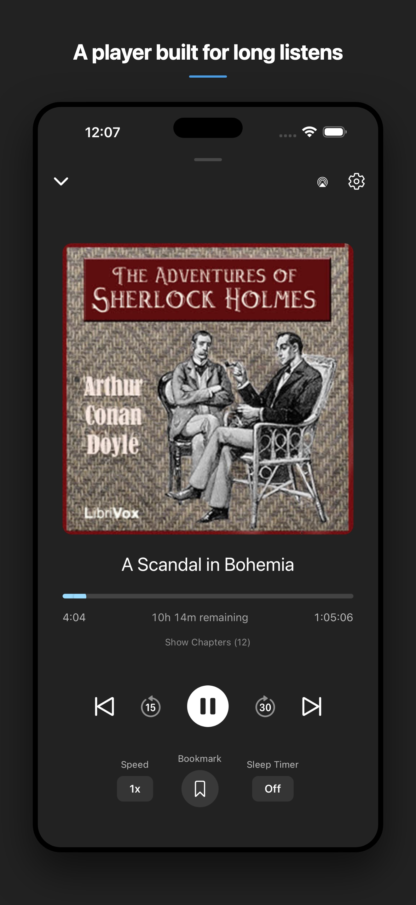
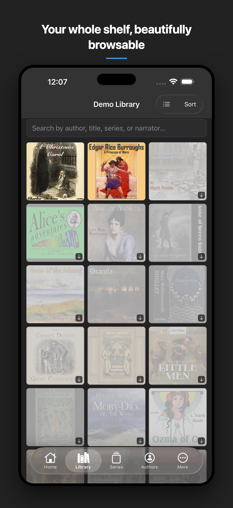
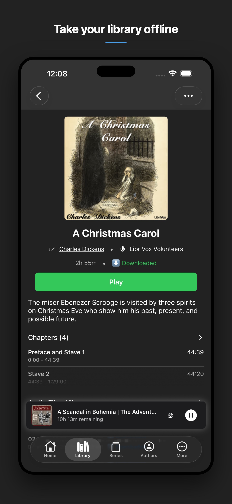
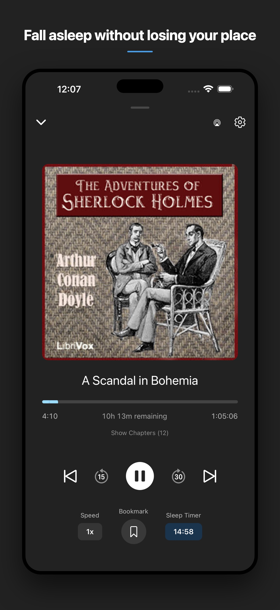
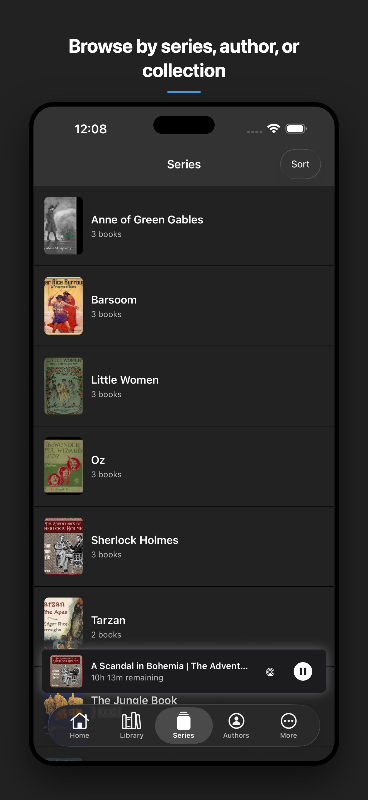

# SideShelf

A modern, feature-rich React Native client for [Audiobookshelf](https://www.audiobookshelf.org/) - the self-hosted audiobook and podcast server.

<!-- TODO: Replace with the real App Store badge once SideShelf is live -->
<!-- [](https://apps.apple.com/app/idXXXXXXXXXX) -->

## 📱 About

This app provides a native mobile experience for your Audiobookshelf library, featuring offline downloads, progress synchronization, and a beautiful, intuitive interface built for audiobook listening.

> **v1.0 is audiobooks only.** Audiobookshelf also serves podcasts, but SideShelf has no podcast UI yet — podcast support is planned for v1.1.

### ✨ Key Features

- **📚 Complete Library Management**: Browse and search your audiobook collection
- **⬇️ Offline Downloads**: Download content for offline listening with intelligent storage management
- **🎵 Advanced Audio Player**: Full-featured player with progress tracking, and playback speed controls
- **🔄 Real-time Sync**: Seamless progress synchronization across all your devices
- **🎨 Beautiful UI**: Modern design with dark/light theme support and customizable layouts
- **🔍 Smart Search**: Find content quickly with advanced filtering and sorting options

## 🚀 Getting Started

### Prerequisites

- Node.js (v18 or later)
- Expo CLI
- Xcode with an iOS Simulator (v1.0 is iOS-only; Android is untested)
- An active Audiobookshelf server

### Installation

1. **Clone the repository**

   ```bash
   git clone https://github.com/clayreimann/SideShelf.git
   cd SideShelf
   ```

2. **Install dependencies**

   ```bash
   npm install
   ```

3. **Run the app**

   The app uses native modules (track player, background downloader), so it requires a
   development build — it does not run in Expo Go.

   ```bash
   npm run ios          # Prebuild and run on the iOS Simulator
   npm run ios:device   # Build and install on a connected iPhone
   ```

### Development Setup

For development with database features:

```bash
# Generate database migrations
npm run drizzle:generate
```

## 🏗️ Architecture

### Tech Stack

- **Framework**: React Native with Expo
- **Navigation**: Expo Router (file-based routing)
- **State Management**: Zustand
- **Database**: SQLite with Drizzle ORM
- **Audio Playback**: react-native-track-player
- **Downloads**: Background downloader with progress tracking
- **Styling**: React Native StyleSheet with theme support

### Project Structure

```
src/
├── app/                    # File-based routing (Expo Router)
├── components/            # Reusable UI components
├── db/                    # Database schema, migrations, and helpers
├── lib/                   # Utility functions and API clients
├── providers/             # React context providers
├── services/              # Business logic and background services
├── stores/                # Zustand state management
└── types/                 # TypeScript type definitions
```

### Key Services

- **PlayerService**: Audio playback management with TrackPlayer integration
- **DownloadService**: Content download management with progress tracking
- **ProgressService**: Progress tracking and server synchronization
- **AuthProvider**: Authentication and token management

## 📖 Usage

### First Time Setup

1. **Server Connection**: Enter your Audiobookshelf server URL and credentials
2. **Library Selection**: Choose your default library from available options
3. **Download Preferences**: Configure download quality and storage settings

### Core Features

#### Library Browsing

- Browse your audiobook collection
- Sort by title, author, date added, or progress
- Switch between grid and list views
- Filter by download status, progress, or genre

#### Content Playback

- Stream directly from your server or play downloaded content
- Automatic progress synchronization across devices
- Chapter navigation and bookmarking
- Variable playback speed and sleep timer

#### Download Management

- Download individual books or entire series
- Monitor download progress with detailed statistics
- Automatic cleanup of old downloads
- Background downloading support

## 📸 Screenshots

Captured against the reproducible LibriVox demo server in [`demo-server/`](demo-server/),
so every cover shown here is public domain. Regenerate with `npm run screenshots`,
which writes the App Store set to the gitignored `.screenshots/store/`; the copies
below are the committed ones GitHub can actually render.

|             |            |  |
| :----------------------------------------------: | :-------------------------------------------------: | :----------------------------------------------: |
|  |  |         |

## 🔗 Deep Links

SideShelf supports `sideshelf://` deep links for navigation and playback control.

### Navigation links

| URL                         | Destination        |
| --------------------------- | ------------------ |
| `sideshelf://home`          | Home tab           |
| `sideshelf://library`       | Library tab        |
| `sideshelf://series`        | Series tab         |
| `sideshelf://authors`       | Authors tab        |
| `sideshelf://more`          | More tab           |
| `sideshelf://item/{itemId}` | Item detail screen |

**Finding an item ID:** Open an item in the app, tap `···` → **Copy Link**, then inspect the copied URL. The UUID at the end is the item ID.

### Playback control links

| URL                      | Action                                                |
| ------------------------ | ----------------------------------------------------- |
| `sideshelf://play-pause` | Toggle play/pause for the current track               |
| `sideshelf://resume`     | Resume the current track (no-op if nothing is loaded) |

### Testing on simulator

```bash
# Open a specific tab
xcrun simctl openurl booted "sideshelf://library"

# Open an item by ID
xcrun simctl openurl booted "sideshelf://item/99562d16-5572-4131-8091-8761da0a2250"

# Toggle playback
xcrun simctl openurl booted "sideshelf://play-pause"
```

All deep links require the user to be authenticated. Unauthenticated links redirect to the login screen.

## 🛠️ Development

### Available Scripts

```bash
npm start                  # Start Expo development server
npm run ios                # Run on iOS Simulator
npm run ios:device         # Build and install on a connected iPhone
npm test                   # Run test suite
npm run lint               # Run ESLint
npm run test:coverage      # Run tests with coverage report
npm run static-analysis    # Typecheck + lint + circular-import check (CI gate)
npm run screenshots        # Capture marketing screenshots via Maestro
npm run build-testflight   # Local production build for TestFlight
```

### Testing

The project includes comprehensive testing with Jest and React Native Testing Library:

```bash
npm test           # Run all tests
npm run test:watch # Run tests in watch mode
npm run test:coverage # Generate coverage report
```

### Contributing

1. Fork the repository
2. Create a feature branch (`git checkout -b feature/amazing-feature`)
3. Commit your changes (`git commit -m 'Add amazing feature'`)
4. Push to the branch (`git push origin feature/amazing-feature`)
5. Open a Pull Request

### Code Style

- Follow the existing ESLint configuration
- Use TypeScript for all new code
- Write tests for new features
- Follow the established project structure

## 📋 Roadmap

See our [TODO.md](./TODO.md) for detailed development plans and feature roadmap.

### Upcoming Features

- **Podcast Support**: Podcast browsing, episode management, and podcast-specific playback (v1.1) — the API and database layers already handle podcast media types; the UI is what's missing
- **CarPlay / Android Auto**: Vehicle integration and audio-browser support (v1.2)
- **Android**: Android support is out of scope for 1.0 and planned for a later release
- **Real-time Updates**: WebSocket integration for live progress sync

## 📄 License

This project is licensed under the MIT License - see the [LICENSE](./LICENSE) file for details.

## 🤝 Acknowledgments

- [Audiobookshelf](https://www.audiobookshelf.org/) - The amazing self-hosted audiobook server
- [Expo](https://expo.dev/) - For making React Native development delightful
- [react-native-track-player](https://react-native-track-player.js.org/) - For excellent audio playback capabilities
- [App icons](https://icon.kitchen/i/H4sIAAAAAAAAAzWPTQ6DIBCF7zLduqBt0r%2BtaXoBd03ToAyUiIxBsGmMd%2B%2BgkQWEb968eTPBKF3CAW4TKBna6oMdwi2GhAVoUzrbyxBzdUB%2BgFJ01qOCAmxDnkmHPr1rohbmAmpTkqPAeHc8XcXxzLraVL%2BePcEEqSz6uLDH9mHrJvfsc5MQUgjBggUdVnRZkfTGsc1V8Bxt7lpjEzk3oMNRRmQF592m6%2BXkSB2p5PKCT3ZQgeySnQa%2Bv1jDa%2F4DLrhsnwMBAAA%3D)

## 📞 Support

- **Issues**: Report bugs and request features on [GitHub Issues](https://github.com/clayreimann/SideShelf/issues)
- **Discussions**: Join the conversation in [GitHub Discussions](https://github.com/clayreimann/SideShelf/discussions)
- **Audiobookshelf Community**: Connect with the broader community on [Discord](https://discord.gg/audiobookshelf)

---

**Built with ❤️ for the Audiobookshelf community**
