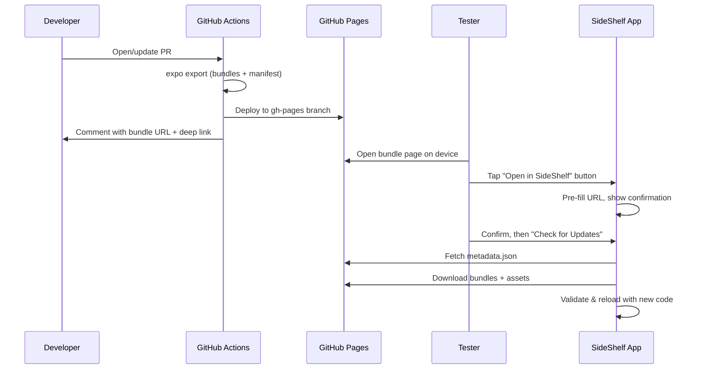

# OTA Updates for TestFlight Builds

This document explains the strategy and rationale for the OTA (Over-The-Air) update system that allows TestFlight builds to load new JavaScript code without requiring a full app rebuild.

## Problem & Solution

**Problem:** Distributing new TestFlight builds for every JavaScript change is slow (20+ minute builds + TestFlight processing + tester downloads).

**Solution:** Use expo-updates to load new JavaScript bundles from GitHub Pages while keeping the same native binary.

**Result:** Test PR changes in ~2 minutes instead of hours. JavaScript-only changes don't require native rebuilds.

## Architecture



## How It Works

### Update Distribution Strategy

1. **Export:** CI runs `expo export` on every PR, generating:
   - Expo manifest (`metadata.json`) with bundle URLs, hashes, and runtime version
   - Hermes bytecode bundles (`.hbc` files) for iOS and Android
   - Assets (images, fonts, icons)

2. **Deploy:** GitHub Actions pushes to `gh-pages` branch incrementally:
   - Each PR gets its own `updates/pr-{number}/` directory
   - Other PRs' directories are preserved (no overwrites)
   - Retry logic handles concurrent deployments
   - Manifest and index page regenerated to list all available PRs

3. **Discover:** PR comment includes:
   - Link to bundle page with "Open in SideShelf" button
   - Deep link: `side-shelf://bundle-loader?url=<PR_URL>`
   - Link to index page showing all available PR bundles

4. **Load:** User workflow:
   - Tap "Open in SideShelf" → App opens with URL pre-filled → Confirm
   - Tap "Check for Updates" → expo-updates downloads and validates
   - Tap "Reload App" → New JavaScript code runs

### Deep Link Integration

**Rationale:** Eliminate manual URL copying/pasting. One-tap workflow from PR comment to loaded bundle.

**Format:** `side-shelf://bundle-loader?url=https://clayreimann.github.io/SideShelf/updates/pr-123`

**Implementation:**

- `_layout.tsx` parses deep link and navigates to Bundle Loader with URL parameter
- `bundle-loader.tsx` receives URL, pre-fills input, shows confirmation dialog
- User must explicitly confirm before URL is saved to settings

**UX Decision:** Require explicit confirmation rather than auto-loading to prevent accidental bundle changes.

### Multi-PR Concurrent Deployment

**Challenge:** GitHub Actions default deployment overwrites entire site.

**Strategy:** Git-based incremental updates to `gh-pages` branch.

Each PR workflow:

1. Fetches existing `gh-pages` (preserves other PRs)
2. Updates only `updates/pr-{number}/`
3. Regenerates `manifest.json` and `index.html`
4. Commits and pushes with 3-attempt retry logic

**Rationale:** Multiple PRs can deploy simultaneously. Race conditions are resolved by rebasing and retrying.

## Configuration Strategy

### Dynamic URL Switching (SDK 52+)

**Capability:** As of Expo SDK 52+, expo-updates supports runtime URL override via `Updates.setUpdateURLAndRequestHeadersOverride()`.

**Implementation in BundleService:**

```typescript
await bundleService.setUpdateURL("https://clayreimann.github.io/SideShelf/updates/pr-123");
// Must completely close and relaunch the app for URL change to take effect
```

**Requirements:**

- Expo SDK 52+ with `expo-updates >= 0.27.0`
- Build must have `expo.updates.disableAntiBrickingMeasures: true` in `app.config.js`
- App must be completely closed and relaunched (not just reloaded) after URL change

**App Configuration:**

```javascript
updates: {
  enabled: true,
  checkAutomatically: "NEVER",
  ...(IS_PREVIEW && { disableAntiBrickingMeasures: true }),
}
```

**Trade-offs:**

- ✅ One TestFlight build can test multiple PRs without rebuilding
- ✅ Switch between PR bundles at runtime via UI
- ✅ No need for server-side redirects or proxy infrastructure
- ❌ Disables embedded update fallback (no auto-rollback to shipped bundle)
- ❌ Requires explicit close/relaunch workflow (can't switch on reload)
- ⚠️ Preview/TestFlight builds only - NOT recommended for production

**Safety Note:** When `disableAntiBrickingMeasures: true` is enabled, expo-updates cannot automatically roll back to the embedded bundle if a bad update crashes on startup. Users may need to reinstall the app in worst-case scenarios. This is acceptable for TestFlight builds but not production.

### Build-Time URL Binding (Legacy/Production)

**For production builds**, continue using build-time URL configuration:

```bash
EXPO_PUBLIC_UPDATE_URL="https://your-production-update-server.com" \
  eas build --profile production --platform ios
```

**Production Configuration:**

```javascript
updates: {
  enabled: true,
  checkAutomatically: "NEVER",
  disableAntiBrickingMeasures: false,  // Keep safety nets enabled
  ...(CUSTOM_UPDATE_URL && { url: CUSTOM_UPDATE_URL }),
}
```

**Rationale:** Production builds should maintain embedded update fallback for safety. Build-time URL binding ensures consistent update source and enables automatic rollback to shipped bundle if updates fail.

### Runtime Version Matching

**Constraint:** expo-updates only loads bundles with matching runtime versions.

**Strategy:** Use `appVersion` policy (reads from `package.json`).

**Rationale:** Prevents loading JavaScript that expects different native APIs. Version bump = native API change = requires rebuild anyway.

### Dynamic Configuration

`app.config.js` uses environment variables:

```javascript
const CUSTOM_UPDATE_URL = process.env.EXPO_PUBLIC_UPDATE_URL;

updates: {
  enabled: true,
  checkAutomatically: "NEVER",  // Manual control only
  ...(CUSTOM_UPDATE_URL && { url: CUSTOM_UPDATE_URL }),
}
```

**Rationale:** Build same codebase with different update URLs without code changes. Manual checking prevents unexpected updates mid-session.

## Deployment Architecture

### GitHub Pages Structure

```
gh-pages branch:
├── index.html                    # Dynamic landing page listing all PRs
└── updates/
    ├── manifest.json             # Array of all PR metadata
    ├── pr-57/
    │   ├── index.html            # Bundle page with deep link button
    │   ├── pr-metadata.json      # PR info (title, branch, commit, timestamp)
    │   ├── metadata.json         # Expo manifest for expo-updates
    │   ├── _expo/static/js/      # Hermes bytecode bundles
    │   └── assets/               # Images, fonts, icons
    └── pr-58/...
```

**Rationale for gh-pages branch:** Free HTTPS hosting, CORS enabled, CDN-backed, no additional services required.

### Workflow Design

`.github/workflows/publish-pr-update.yml` runs on PR open/update:

1. Export bundles (`expo export`)
2. Upload artifact (30-day retention fallback)
3. Fetch `gh-pages` and checkout
4. Copy bundles to `updates/pr-{number}/`
5. Generate HTML pages with deep link buttons
6. Regenerate manifest listing all PRs
7. Commit and push (with retry logic)
8. Comment on PR with links

**Rationale:** Zero manual steps. Testers get instant access via PR comment.

## Security Model

### Integrity Validation

expo-updates validates:

- Bundle SHA-256 hash matches manifest
- Runtime version compatibility
- Asset checksums

**Rationale:** Prevents loading tampered or incompatible bundles.

### Trust Model

**Assumption:** GitHub repository access is trusted. Workflow changes reviewed in PRs.

**Mitigation:** Restrict `gh-pages` write access, use branch protection.

**Trade-off:** No additional manifest signing. Added complexity not justified given existing GitHub trust model.

### Transport Security

expo-updates requires HTTPS. GitHub Pages provides this automatically.

**Rationale:** Prevents MITM attacks during bundle download.

## Limitations & Constraints

### Dynamic URL Switching Limitations

**Current Implementation (SDK 52+):**

- UI saves URL ✅
- URL displayed in UI ✅
- Runtime URL override ✅ (via `setUpdateURLAndRequestHeadersOverride`)
- Requires app relaunch ⚠️ (must completely close and reopen app)
- Disables embedded fallback ⚠️ (requires `disableAntiBrickingMeasures: true`)

**Workflow Requirements:**

1. Enter URL in Bundle Loader screen
2. Tap "Switch to This URL"
3. **Close app completely** (kill from app switcher)
4. **Relaunch app** (open fresh)
5. Tap "Check for Updates" to fetch from new URL

**Important:** Simply reloading the app (via "Reload App" button) will NOT apply the URL change. The app must be terminated and reopened.

**Safety Trade-off:** Preview builds with dynamic URL switching cannot automatically roll back to the embedded bundle if a bad update crashes. This is acceptable for TestFlight QA but not for production releases.

### Preview/Production Builds Only

Development builds use Metro bundler, not expo-updates.

**Rationale:** Dev builds prioritize fast refresh and debugging.

### Runtime Version Must Match

App version `1.0.0` can only load updates with version `1.0.0`.

**Rationale:** Version bumps typically indicate native API changes requiring rebuild anyway.

## Summary

**Strategy:** Automated per-PR bundle export deployed to GitHub Pages with git-based incremental updates. Deep links enable one-tap loading from PR comments. Dynamic URL switching (SDK 52+) allows one TestFlight build to test multiple PRs.

**Trade-offs:**

- ✅ Fast iteration (2 minutes vs 20 minutes)
- ✅ Free hosting (GitHub Pages)
- ✅ Zero-touch automation (CI handles everything)
- ✅ Multi-PR support (concurrent deployments work)
- ✅ Dynamic URL switching (one TestFlight build, multiple PRs)
- ✅ Runtime URL override (no rebuild needed to switch PRs)
- ❌ Requires app relaunch for URL changes (can't switch on reload)
- ❌ Preview builds disable embedded fallback (no auto-rollback safety)
- ❌ Rebuild required for native changes (expected)

**Rationale:** Dynamic URL switching (SDK 52+) eliminates the need to rebuild for each PR while maintaining fast iteration. The safety trade-off (disabled embedded fallback) is acceptable for TestFlight/preview builds. Production builds continue using build-time URL binding with full safety features enabled.
