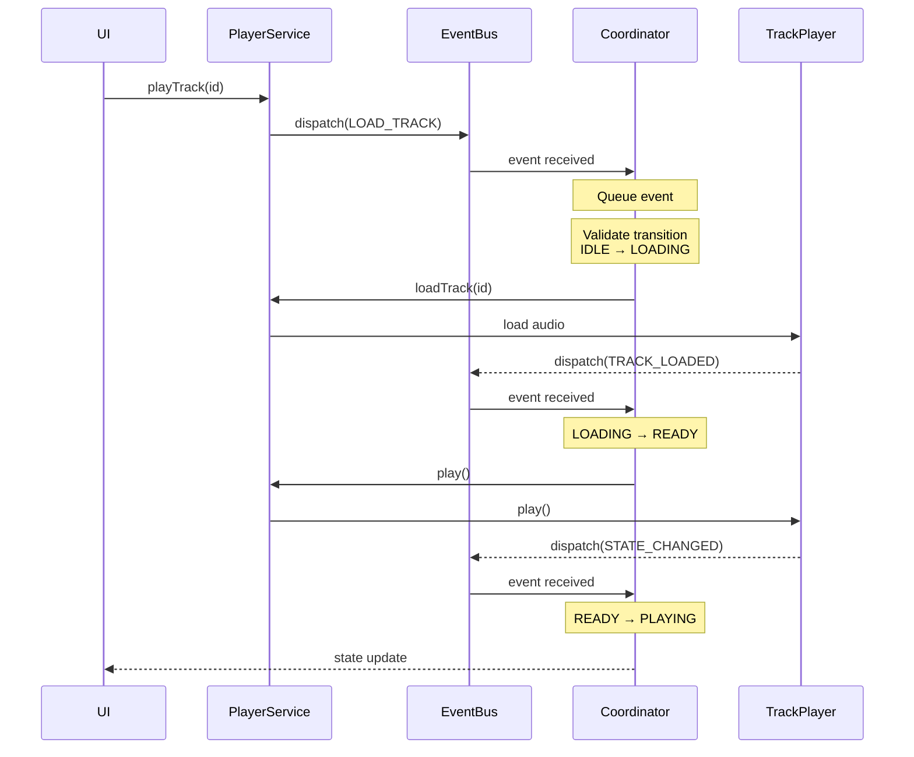

# Player State Machine Architecture

## Overview

This document describes the event-driven state machine architecture that coordinates player synchronization in SideShelf. The design eliminates race conditions and position drift by introducing a central coordinator that acts as a single source of truth.

**Status:** Phase 1 Complete - Coordinator running in observer mode
**Next Steps:** See [Migration Plan](../plans/state-machine-migration.md)

---

## Problem

### Current Architecture

The current player system consists of four components that maintain state independently:

- **PlayerService** - Handles UI commands and orchestrates playback
- **PlayerBackgroundService** - Processes native player events
- **ProgressService** - Manages database persistence and server sync
- **playerSlice** - Zustand store for UI state

### Core Issues

**1. Multiple Sources of Truth**

Each component maintains its own version of player state (position, playback status, current track). This requires complex reconciliation logic scattered across components, leading to drift and inconsistency.

**2. Race Conditions**

Concurrent operations can create duplicate sessions or conflicting position updates:

- Two paths checking for existing session simultaneously
- Progress updates while seeking
- Position reconciliation during playback

**3. Implicit Event Ordering**

Native player events arrive in unpredictable order. Current code uses guard clauses and flags (like `isRestoringState`) to coordinate, which is fragile and hard to test.

**4. Complex Position Reconciliation**

Position must be reconciled from four sources: database, store, AsyncStorage, and native player. Logic is scattered across services with no clear priority ordering.

---

## Solution

### Architecture

The PlayerStateCoordinator introduces a finite state machine with serial event processing to eliminate race conditions and provide a single source of truth.


### Key Principles

**1. Event Bus Decoupling**

Services dispatch events to a central event bus instead of calling the coordinator directly. This prevents circular dependencies:

- Services import and dispatch to EventBus
- Coordinator subscribes to EventBus
- Coordinator can import and call service methods
- Clean acyclic dependency graph

**2. Serial Event Processing**

Events are queued and processed one at a time using an async lock. This eliminates race conditions:

- No concurrent session creation
- No conflicting position updates
- Predictable state transitions

**3. Single Source of Truth**

Coordinator owns canonical state:

- Current player state (idle, playing, paused, etc.)
- Current position and duration
- Active track and session
- Reconciles all position sources with clear priority

**4. Explicit State Transitions**

Finite state machine validates all transitions:

- Only allowed transitions succeed
- Invalid transitions are logged and rejected
- Complete audit trail of state changes

### State Machine


### State Definitions

- **IDLE** - No track loaded, player inactive
- **LOADING** - Loading track metadata and audio files
- **READY** - Track loaded and ready to play
- **PLAYING** - Active playback in progress
- **PAUSED** - Playback paused, can resume
- **SEEKING** - Seek operation in progress
- **BUFFERING** - Waiting for audio data
- **STOPPING** - Stopping playback, transitioning to IDLE
- **RESTORING** - Restoring previous playback session on app startup
- **SYNCING_POSITION** - Reconciling position from multiple sources (future use)
- **SYNCING_SESSION** - Synchronizing session with server (deprecated - sync is now concurrent)
- **ERROR** - Recoverable error state
- **FATAL_ERROR** - Non-recoverable error requiring user intervention

**Note:** Session synchronization is now handled via no-op events (SESSION_SYNC_STARTED, SESSION_SYNC_COMPLETED) that run concurrently with playback rather than as an exclusive state.

### Event Flow



---

## Benefits

### Eliminates Race Conditions

Serial event processing ensures only one operation modifies state at a time. Multiple session creation attempts are queued and processed sequentially, with only the first succeeding.

### Single Source of Truth

Coordinator owns canonical position and state. Services query coordinator instead of maintaining duplicate state. Reconciliation logic centralized in one location.

### Explicit Coordination

State machine replaces implicit flags (`isRestoringState`, `sessionCreationInProgress`) with explicit states. Transitions are validated and logged.

### Improved Debugging

Complete event history and state transition log provides audit trail. Diagnostic UI shows real-time state machine status.

### Better Testing

State transitions can be tested in isolation. Event sequences can be simulated to validate behavior. No need to mock complex service interactions.

### Simplified Services

Services become thinner execution layers:

- PlayerService executes coordinator commands
- PlayerBackgroundService forwards native events
- ProgressService handles database persistence
- playerSlice replaced by coordinator subscriptions

---

## Implementation Status

### Phase 1: Observer Mode ✅ Complete

Coordinator observes and validates state transitions without affecting behavior.

**Components:**

- `src/types/coordinator.ts` - Type definitions and interfaces
- `src/services/coordinator/eventBus.ts` - Event bus implementation
- `src/services/coordinator/transitions.ts` - State transition matrix with no-op events
- `src/services/coordinator/PlayerStateCoordinator.ts` - Main coordinator with context synchronization
- Comprehensive test suite (116+ tests, 90%+ coverage)

**Event Integration Points:**

- `PlayerService` - LOAD_TRACK, PLAY, PAUSE, STOP, RELOAD_QUEUE, QUEUE_RELOADED
- `PlayerBackgroundService` - All native player events (NATIVE\_\*)
- `ProgressService` - SESSION*CREATED, SESSION_ENDED, SESSION_SYNC*\*, SESSION_UPDATED
- `playerSlice` - RESTORE_STATE on app initialization
- `index.ts` - APP_FOREGROUNDED during app startup

**Key Features:**

- ✅ Serial event processing via async queue
- ✅ State transition validation and logging
- ✅ Context synchronization from event payloads
- ✅ Transition history tracking (100 entry circular buffer)
- ✅ Comprehensive diagnostics UI in Track Player screen
- ✅ No-op events for progress updates and session lifecycle

**Phase 1 Completeness:**
The coordinator now fully tracks player state in observer mode:

- Internal state machine updates correctly (idle → loading → ready → playing)
- Context fields synchronized from events (position, duration, sessionId, track info)
- Transition history provides audit trail of all state changes
- Session lifecycle events properly marked as no-op
- Queue reload events handle TrackPlayer rebuilding scenarios

**Validation:** Running in production with accurate state tracking and minimal rejected transitions.

### Next Phases

See [State Machine Migration Plan](../plans/state-machine-migration.md) for detailed roadmap:

- **Phase 2:** Execute transitions through coordinator
- **Phase 3:** Centralize position reconciliation
- **Phase 4:** Replace playerSlice with subscriptions
- **Phase 5:** Remove legacy coordination code

---

## Design Decisions

### Why Event Bus?

Prevents circular dependencies. Services can dispatch events without importing coordinator. Coordinator can import and call service methods without cycles.

### Why Serial Processing?

Guarantees no race conditions. Simpler reasoning about state. Easier to debug with clear event ordering. Performance impact negligible (<10ms per event).

### Why Finite State Machine?

Makes valid transitions explicit. Provides validation and error detection. Easier to visualize and test. Clear semantics for each state.

### Why Phase 1 Observer Mode?

Zero risk deployment. Validates state machine logic in production. Identifies edge cases before execution. Provides diagnostic foundation for future phases.

---

## Monitoring

### Metrics

Track in production:

- Event processing time (target: <10ms average)
- Queue depth (target: <5 events)
- Invalid transition rate (target: <1%)
- Total events processed and state transition count

### Diagnostics

Available in Track Player debug screen (More → Track Player → Coordinator Diagnostics):

**Real-time Metrics:**

- Current state and previous state
- Event queue depth (typically 0 - events are processed immediately)
- Total events processed
- State transition count
- Rejected transition count
- Average processing time

**Current Context:**

- Track information (libraryItemId, title, duration)
- Position and duration
- Session ID and session start time
- Playback configuration (rate, volume)
- State flags (isPlaying, isBuffering, isSeeking, etc.)
- Last server sync timestamp
- Position reconciliation count

**Transition History:**

- Last 20 transitions (from 100-entry circular buffer)
- Each entry shows:
  - Event type
  - State transition (from → to)
  - Timestamp
  - Acceptance status (✅ accepted, ❌ rejected)
  - Rejection reason (if rejected)
  - "No state change" indicator (for no-op events)
- Visual styling: Green for accepted, Red for rejected, Gray for no-op

**Export Capability:**

- Export full diagnostics to JSON file for debugging
- Includes all metrics, context, and full transition history

### Alerts

Monitor for:

- Invalid transitions (indicates missing edge cases)
- High queue depth (indicates performance issues)
- High rejection rate (>5% of events)
- Error state frequency

---

## Key Implementation Details

### No-Op Events

Certain events update context but don't cause state transitions. These are marked as "no-op events":

- **NATIVE_PROGRESS_UPDATED** - Position/duration updates during playback
- **SESSION_UPDATED** - Periodic session position updates (throttled to 10s)
- **SESSION_CREATED** - Session lifecycle start
- **SESSION_ENDED** - Session lifecycle end
- **SESSION_SYNC_STARTED** - Server sync begins (concurrent with playback)
- **SESSION_SYNC_COMPLETED** - Server sync completes
- **SESSION_SYNC_FAILED** - Server sync fails
- **CHAPTER_CHANGED** - Chapter boundary crossed

These events are allowed from any state and update coordinator context without changing the state machine state.

### State Restoration Flow

On app startup, the restoration sequence is:

1. **APP_FOREGROUNDED** - App launches (IDLE → IDLE, no-op)
2. **RESTORE_STATE** - playerSlice restores from AsyncStorage (IDLE → RESTORING)
3. **RELOAD_QUEUE** (if needed) - TrackPlayer queue rebuilt (RESTORING → LOADING)
4. **QUEUE_RELOADED** - Queue ready (LOADING → READY)
5. **PLAY/PAUSE** - User can control playback (READY → PLAYING/PAUSED)

The RESTORING state allows PLAY/PAUSE events so users can control playback during restoration.

### Queue Reload Events

When TrackPlayer detects queue mismatch (e.g., app restart, track change), PlayerService rebuilds the queue:

1. **RELOAD_QUEUE** - Signals queue rebuild starting
2. **NATIVE_STATE_CHANGED/NATIVE_TRACK_CHANGED** - TrackPlayer events during rebuild (allowed in LOADING)
3. **QUEUE_RELOADED** - Signals queue is ready with correct position

This prevents rejections of native events during queue rebuilding.

### Context Synchronization

The coordinator maintains accurate context by processing event payloads:

- **RESTORE_STATE** - Sets track, position, playbackRate, volume, isPlaying, sessionId
- **SESSION_CREATED** - Sets sessionId and sessionStartTime
- **NATIVE_PROGRESS_UPDATED** - Updates position, duration, lastPositionUpdate
- **PLAY/PAUSE** - Updates isPlaying flag
- **QUEUE_RELOADED** - Updates position after queue rebuild
- **SESSION_SYNC_COMPLETED** - Updates lastServerSync timestamp

This ensures the coordinator has complete, accurate state for validation and diagnostics.

### Observer Mode Behavior

In Phase 1 observer mode, the coordinator operates with a critical design principle: **context updates from ALL events to reflect actual system state**.

#### Core Behavior

- ✅ Events are queued and processed serially
- ✅ State transitions are validated against transition matrix
- ✅ Internal state machine updates (idle → loading → playing)
- ✅ **Context fields update from ALL events (including NATIVE\_\*)**
- ✅ Transition history tracked for audit trail
- ❌ **No execution** - Coordinator doesn't call service methods
- ❌ **No control** - Services continue to manage state independently

#### State Machine State vs Context

This distinction is critical for Phase 1 validation:

**State Machine State** (e.g., PLAYING, PAUSED):

- Represents the **logical phase** of playback
- Changes through explicit transitions
- Validates allowed transitions
- May have no-op transitions (PLAYING→PLAYING)
- Represents "what phase are we in"

**Context Fields** (e.g., isPlaying, position):

- Represent the **actual current reality**
- Update from ALL events including NATIVE\_\*
- Always reflect current system state
- May change within same state machine state
- Represent "what's actually happening"

#### Example: Lock Screen Controls

When user pauses via lock screen while state machine is in PLAYING:

```typescript
// NATIVE_STATE_CHANGED arrives from lock screen
coordinator.dispatch({ type: 'NATIVE_STATE_CHANGED', payload: { state: State.Paused } });

// Result:
State Machine: PLAYING (no-op transition PLAYING→PLAYING allowed)
Context: isPlaying = false (updated to reflect actual player state)

// Diagnostics UI can show:
// "State: PLAYING, Actually Playing: No"
// This reveals the mismatch and validates state machine behavior
```

#### Why This Matters

**Phase 1 Validation Goal:** Verify the state machine accurately models real system behavior before Phase 2 gives it control.

With context updates from ALL events:

- ✅ **Accurate Reality Tracking**: Context shows what's actually happening
- ✅ **State Machine Comparison**: Can compare predictions vs reality
- ✅ **Diagnostics Visibility**: UI shows both coordinator state AND actual state
- ✅ **Mismatch Detection**: Identifies missing transitions or incorrect model

Without context updates from NATIVE\_\* events:

- ❌ Context would be stale
- ❌ Can't see if coordinator's view matches reality
- ❌ Can't validate state machine correctness
- ❌ Phase 1 validation would be incomplete

#### NATIVE_STATE_CHANGED Handler

**Implementation:** `src/services/coordinator/PlayerStateCoordinator.ts:411-433`

```typescript
case "NATIVE_STATE_CHANGED":
  // Update context to reflect actual native player state
  // This is critical for Phase 1 validation - diagnostics UI needs accurate state
  if (event.payload.state !== undefined) {
    const State = {
      None: 0, Ready: 1, Playing: 2, Paused: 3,
      Stopped: 4, Buffering: 6, Connecting: 8,
    };
    this.context.isPlaying = event.payload.state === State.Playing;
    log.debug(
      `[Coordinator] Context updated from NATIVE_STATE_CHANGED: isPlaying=${this.context.isPlaying}`
    );
  }
  break;
```

#### Transition to Phase 2

In Phase 2, when coordinator starts controlling execution:

**What Changes:**

- Coordinator calls service methods (executes transitions)
- State machine state drives behavior (not just observes)

**What Stays the Same:**

- Context still updates from ALL events
- NATIVE\_\* events still update context
- Diagnostics still show accurate state

**Why Context Updates Persist:**
Even in Phase 2+, context must update from NATIVE\_\* events because:

1. **Confirmation**: Verify execution actually happened
2. **External events**: Lock screen, headphones still generate NATIVE\_\* events
3. **Reality check**: Detect if native player disagrees with coordinator

The coordinator tracks state accurately to prepare for Phase 2, where it will begin executing transitions.

---

## References

- [Migration Plan](../plans/state-machine-migration.md) - Implementation roadmap
- [Coordinator Tests](../../src/services/coordinator/__tests__/) - Test suite
- [Track Player Screen](<../../src/app/(tabs)/more/track-player.tsx>) - Diagnostic UI
