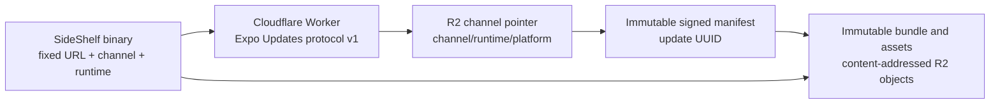

# Self-Hosted OTA Updates with Cloudflare Worker and R2

**Date:** 2026-07-28

**Status:** Approved

**Scope:** Interim removal of SideShelf's nonfunctional GitHub Pages OTA path and the future design for production-capable, self-hosted Expo Updates delivery

## Goal

Replace SideShelf's current GitHub Pages OTA claims with an honest disabled state, then implement a production-capable update service that:

- uses the standard `expo-updates` client already embedded in SideShelf;
- serves Expo Updates protocol v1 responses from a Cloudflare Worker;
- stores immutable bundles, assets, manifests, and promotion records in R2;
- uses one fixed update URL and build-selected channels;
- supports preview validation, atomic production promotion, and fast rollback;
- preserves Expo's embedded-bundle recovery behavior;
- signs production update manifests; and
- can operate within Cloudflare's free allowances at SideShelf's current personal-project scale.

The design must work for App Store and TestFlight builds. It must never deliver an update to a binary with an incompatible native runtime.

## Current State and Problem

The existing OTA path is not a working Expo Updates service:

- `npx expo export` produces export metadata and assets, not a protocol-compliant Expo Updates manifest endpoint.
- The GitHub Pages workflows upload static export output and describe it as directly installable.
- The PR workflow masks Pages deployment failures with `continue-on-error`.
- The documented Pages site was not live during the audit.
- Current builds do not embed a usable update URL unless `EXPO_PUBLIC_UPDATE_URL` is supplied.
- The app exposes an arbitrary URL loader that depends on `disableAntiBrickingMeasures`, which Expo advises against for production use.
- Several workflow and documentation deep links use `side-shelf://`, while the registered application scheme is `sideshelf`.

Consequently, a green export or workflow run is not proof that an installed SideShelf binary can discover, download, verify, launch, or recover from an update.

## Decision Summary

SideShelf will:

1. remove the false GitHub Pages publication path and user-facing custom bundle loader now;
2. retain `expo-updates`, native integration, runtime configuration, and safe embedded fallback;
3. remain explicitly OTA-disabled until a fixed Worker endpoint has passed the required gates;
4. use a Worker only for protocol-aware manifest selection and responses;
5. store content-addressed immutable objects and small mutable channel pointers in R2;
6. select updates by exact channel, platform, and runtime version;
7. publish immutable content first and update the channel pointer last;
8. require signed manifests before production enablement; and
9. keep EAS Update Free as the managed fallback if DIY operational work becomes disproportionate.

## Alternatives Considered

### Keep GitHub Pages as a static update server

Rejected. Static export output is not an Expo Updates protocol server. A static host could store assets, but a protocol-aware endpoint is still required to select a compatible update and return the correct response.

### Use GitHub Actions artifacts or GitHub Releases as the backing store

Rejected as the primary design. Actions artifacts expire and require workflow/repository access. GitHub Releases can host immutable binaries, but add an external dependency, weaker cache and object-management control, and no advantage over R2 for this project. GitHub artifacts may remain diagnostic evidence only.

### Remove `expo-updates` completely until the server exists

Rejected. Removing and later restoring the native module creates avoidable native configuration and build churn. The safe client core can remain dormant without claiming the feature works.

### Keep the Bundle Loader hidden

Rejected. Hidden dead code still preserves unsafe URL override behavior, stale storage/state surfaces, misleading deep links, and untested maintenance burden.

### Use EAS Update now

Viable but not selected. EAS Free is a legitimate managed option at SideShelf's current scale. Worker plus R2 is selected for infrastructure control and to avoid coupling future update delivery to an MAU subscription boundary. EAS remains the fallback described in [Cost and Reconsideration Triggers](#cost-and-reconsideration-triggers).

## Interim Truthful State

Before the Worker implementation begins, the repository must make OTA unavailable rather than imply that it is partially usable.

### Remove

- `.github/workflows/publish-pr-update.yml`
- `.github/workflows/publish-release-update.yml`
- `.github/workflows/cleanup-pr-bundle.yml`
- `.github/workflows/README-cleanup.md`
- OTA bundle export, artifact upload, and bundle-loading comments from `.github/workflows/test-coverage.yml`
- `src/app/(tabs)/more/bundle-loader.tsx`
- the Bundle Loader row in `src/app/(tabs)/more/settings.tsx`
- bundle-loader deep-link routing from `src/app/_layout.tsx`
- `src/services/BundleService.ts`
- `customUpdateUrl` persistence, Zustand state/actions/selectors, and focused tests
- `EXPO_PUBLIC_UPDATE_URL` configuration
- preview-only `disableAntiBrickingMeasures`
- release documentation that claims PRs or tags publish usable OTA updates

Existing `@app/customUpdateUrl` values may remain as harmless orphaned AsyncStorage entries on installed devices. A migration solely to delete an unused preference is not justified.

### Retain

- the `expo-updates` dependency and native integration;
- `updates.enabled`;
- `updates.checkAutomatically: "NEVER"` while no fixed endpoint exists;
- `updates.fallbackToCacheTimeout: 0`;
- runtime-version configuration;
- `preview` and `production` build-profile channel names; and
- all default anti-bricking and embedded-bundle recovery behavior.

The architecture document at `docs/architecture/OTA_UPDATES.md` must be replaced or reduced to a short status page that points to this approved design and explicitly says OTA is not currently available. `RELEASE.md` must describe real binary build/submission behavior only.

## Target Runtime Architecture



### Client configuration

Every enabled binary contains:

- one fixed HTTPS manifest URL under a domain controlled by the SideShelf owner;
- one embedded `expo-channel-name` request header;
- an exact runtime version representing the binary's native compatibility boundary;
- the public certificate required to verify signed manifests; and
- safe embedded-update recovery configuration.

Production builds use the `production` channel. Preview/TestFlight builds use the `preview` channel. Channel names are routing metadata, not authorization secrets.

The production client does not expose:

- a user-entered update URL;
- `setUpdateURLAndRequestHeadersOverride`;
- arbitrary channel switching;
- `disableAntiBrickingMeasures`; or
- a deep link that changes update configuration.

The current `appVersion` runtime policy may remain during the disabled interim state. Before preview publication is enabled, the implementation must adopt the `fingerprint` runtime policy so the runtime changes whenever the native compatibility boundary changes. If the active Expo toolchain cannot generate the same fingerprint deterministically during binary builds and update exports, implementation stops and this design must be amended before publication. A manual convention to remember an app-version bump is not sufficient evidence.

After the fixed endpoint is validated and embedded in a new binary, the target launch behavior is:

- check for an update on launch;
- use a zero fallback timeout so update discovery does not hold the user on the splash screen;
- download a compatible update for the next cold launch; and
- continue using the embedded or last-known-good cached update if the server is unavailable.

An explicit in-app “update now” experience is outside the initial implementation. Automatic safe delivery is the first production path.

### Manifest endpoint

The Worker exposes a stable endpoint such as:

```text
https://updates.<owned-domain>/manifest
```

For each request it validates:

- HTTP method;
- `expo-protocol-version`;
- accepted manifest content types;
- `expo-platform`;
- `expo-runtime-version`; and
- `expo-channel-name`.

Only protocol version 1 is supported initially. The Worker selects an update only when channel, platform, and runtime match exactly. Unknown channels, malformed values, and unsupported protocol versions fail closed. A valid request with no compatible update returns the protocol-defined no-update response.

The Worker must not infer a runtime, fall back to a nearby app version, or cross from preview to production.

### R2 object layout

The logical key layout is:

```text
channels/<channel>/<platform>/<runtimeVersion>/current.json
promotions/<channel>/<platform>/<runtimeVersion>/<timestamp>-<updateId>-intent.json
promotions/<channel>/<platform>/<runtimeVersion>/<timestamp>-<updateId>-result.json
updates/<runtimeVersion>/<platform>/<updateId>/manifest.json
objects/sha256/<prefix>/<contentHash>
```

`current.json` is the only mutable delivery pointer. It contains at least:

- schema version;
- channel;
- platform;
- runtime version;
- update UUID;
- immutable manifest key;
- source commit SHA;
- publication timestamp; and
- signing-certificate identifier.

Promotion intent and result records are append-only and retain both the previous and requested pointer values. The result records whether the conditional pointer write succeeded or failed. They make promotion and rollback auditable without depending on mutable CI logs.

Bundle and asset objects are addressed by their SHA-256 content hash. They are uploaded with immutable cache headers and are never overwritten. Manifests are stored under an update UUID and are also immutable. Assets may be served through an R2 custom domain separate from the Worker endpoint so asset downloads do not require manifest-selection code.

### Protocol manifest

The publisher, not the Worker, generates the immutable manifest. The Worker performs selection and response assembly but does not calculate bundle hashes on each request.

Every manifest includes the fields required by Expo Updates protocol v1, including:

- update UUID;
- creation time;
- exact runtime version;
- launch asset;
- referenced assets;
- metadata used for filtering and audit;
- expected content hashes;
- file extensions and MIME types where required; and
- source commit and channel metadata that do not weaken compatibility selection.

The implementation should start from Expo's official custom update-server example and protocol specification, then add SideShelf's R2 layout, promotion model, tests, and signing. It must not reverse-engineer EAS responses from captured traffic when a published protocol exists.

## Publishing and Promotion

### Initial trigger

The first publisher is a manual GitHub Actions `workflow_dispatch` workflow. Automatic PR and release publication are deferred until the protocol, rollback, signing, and physical-device path are proven.

The workflow accepts explicit inputs for:

- source Git ref or commit;
- channel;
- platform set;
- expected runtime version; and
- whether the run may promote after verification.

The workflow resolves and records the immutable commit SHA. Production publication uses a protected GitHub `production` environment with required approval.

### Ordered publication

For each platform, the publisher:

1. checks out the requested immutable commit;
2. installs locked dependencies;
3. derives the runtime version using the same configuration as the target binary;
4. fails if the derived runtime differs from the requested runtime;
5. exports the application bundle and assets;
6. generates the protocol manifest, update UUID, hashes, MIME metadata, and source metadata;
7. signs the manifest;
8. uploads content-addressed bundle and asset objects;
9. uploads the immutable manifest;
10. fetches every object through its public delivery URL and verifies status, length, type, and hash;
11. queries the Worker with the intended headers without changing the live pointer;
12. records a candidate validation result;
13. writes an append-only promotion-intent record;
14. updates `current.json` with a conditional write as the final delivery-state mutation; and
15. writes an append-only promotion-result record containing the pointer-write outcome.

No failed or cancelled run may update the live pointer. Concurrent promotions to the same channel/platform/runtime must use an ETag or equivalent compare-and-swap guard so a stale run cannot overwrite a newer promotion.

### Preview and production separation

Preview and production pointers are independent. A preview update is never promoted by copying a mutable preview pointer. Production promotion references the already verified immutable update content and writes a new signed production promotion record.

PR-preview automation is a later optimization. It may be introduced only after:

- the manual preview path is repeatable;
- preview cleanup and retention policies are defined;
- untrusted fork PRs cannot access Cloudflare or signing secrets;
- update selection cannot escape the preview channel; and
- generated comments link to retained evidence rather than claim that a raw artifact is installable.

## Signing and Security

HTTPS protects transport, but the production design also authenticates the publisher through Expo Updates code signing.

- The private signing key is stored only in a protected GitHub environment or a dedicated signing system.
- The Worker and R2 never receive the private key.
- The binary embeds the public certificate used by `expo-updates` to verify manifests.
- The manifest signature covers the canonical manifest data required by the Expo protocol.
- Key rotation requires a planned overlap or a new binary containing the next trusted certificate.
- Cloudflare credentials use least privilege: immutable object writes and pointer promotion are separated where practical.
- The R2 bucket does not permit public listing or public writes.
- The Worker accepts public manifest reads because installed apps need them, but exposes no public promotion endpoint.
- No Audiobookshelf credentials, tokens, server URLs, user identifiers, library data, or playback data enter manifests or operational logs.

Production publication is blocked until signing succeeds end to end on a release build. An unsigned HTTPS-only prototype may be used locally or in an isolated preview environment, but it is not production evidence.

## Rollback and Failure Handling

Rollback selects a previously verified immutable manifest by writing a new promotion record and conditionally updating `current.json`. It never rebuilds or mutates the old update.

The operator can also set a channel/runtime/platform combination to “no update,” causing compatible clients to remain on their embedded or cached update.

Required behavior:

- a missing pointer returns no update;
- missing manifest or object references block promotion and alert the operator;
- an R2 or Worker outage leaves the installed app on an embedded or cached update;
- a signature failure rejects the update;
- an incompatible runtime receives no update;
- a failed update launch exercises Expo's recovery path;
- rollback evidence names the old and new update IDs, runtime, channel, platform, reason, actor, and time; and
- immutable objects are retained through the rollback window.

Initial retention is indefinite while storage remains within the R2 free allowance. A later pruning policy must always retain:

- the current update;
- the previous known-good update for every active runtime;
- every update referenced by a still-supported binary; and
- promotion records.

## Observability

Worker telemetry records:

- request result category;
- protocol version;
- channel;
- platform;
- runtime version;
- selected update ID, if any;
- response status;
- R2 lookup result; and
- latency.

It must not record IP addresses beyond Cloudflare's unavoidable platform-level handling, request bodies, device identifiers, or application/user data in custom logs.

Operational dashboards or queries must distinguish:

- compatible update served;
- no compatible update;
- malformed/unsupported request;
- missing R2 object;
- signature/configuration error;
- Worker exception; and
- asset delivery failure.

Alerts are required for sustained Worker errors, missing referenced objects, and failed production promotions. Raw update-download counts are operational metrics, not proof that the update successfully launched; device acceptance and crash evidence remain separate.

## Validation Gates

OTA remains unavailable to users until every required gate passes.

### Gate 0: Interim cleanup

- No workflow or documentation claims GitHub Pages, Releases, or Actions artifacts are installable OTA updates.
- No Bundle Loader route, setting, custom URL state, deep link, or unsafe preview configuration remains.
- The effective Expo configuration has no update URL and keeps automatic checks disabled.
- The application test suite and changed-file static checks pass.

### Gate 1: Worker protocol

- Unit tests cover every accepted and rejected header combination.
- Exact channel/platform/runtime matching is proven.
- Valid manifest, no-update, malformed-request, unsupported-protocol, missing-pointer, and missing-object responses are covered.
- Response content types and Expo protocol headers match the official specification.
- R2 keys and response URLs cannot be escaped through untrusted header input.

### Gate 2: Publisher and atomicity

- Hash and manifest generation are deterministic for a fixed export.
- An interrupted upload cannot change the live pointer.
- A missing or corrupted object blocks promotion.
- Conditional pointer updates reject stale concurrent publishers.
- Promotion records are append-only.
- Rollback selects a prior immutable update without rebuilding it.
- Signing succeeds and tampering causes verification failure.

### Gate 3: Local integration

- A local Worker/R2-compatible environment serves a complete exported update to the Expo client or an official protocol test harness.
- Bundle and every asset URL are fetched and hash-verified.
- Empty, corrupt, stale, and incompatible fixtures fail as designed.
- Tests run without real production credentials or production R2 mutation.

### Gate 4: Preview physical-device acceptance

Use a release-style preview build on supported physical iOS and Android devices.

Required scenarios:

- fresh install launches the embedded bundle;
- matching update downloads and launches on a later cold start;
- offline launch uses embedded or cached content;
- Worker outage does not block launch;
- incompatible platform and runtime are rejected;
- tampered manifest or asset is rejected;
- a crashing update exercises recovery;
- rollback returns the device to the selected known-good update;
- an installed update survives normal relaunches; and
- app data, downloads, authentication, playback, and progress remain intact.

Evidence records device, OS, app version/build, runtime, channel, update ID, commit, result, logs, and tester.

### Gate 5: Production enablement

- The fixed production Worker URL, production channel header, fingerprint runtime, and signing certificate are embedded in a new production binary.
- The built native configuration is inspected directly on iOS and Android.
- A TestFlight/internal-production canary passes the complete preview matrix.
- Worker/R2 monitoring and rollback access are available to the operator.
- The production pointer initially returns no update.
- A signed canary update is promoted through the protected environment.
- An explicit `GO` is recorded before broader promotion.

A successful export, workflow, Worker deployment, or manifest request alone does not satisfy these gates.

## Cost and Reconsideration Triggers

Pricing and limits below were verified on 2026-07-28 and will drift. Recheck the source pages before implementation or a production decision.

| Option                  | Current included update capacity                                                                  | Subscription | SideShelf implication                                               |
| ----------------------- | ------------------------------------------------------------------------------------------------- | ------------ | ------------------------------------------------------------------- |
| EAS Free                | Unlimited updates; 1,000 update MAUs; 100 GiB bandwidth; 20 GiB storage                           | $0           | Likely sufficient now and lowest operational effort                 |
| EAS Starter             | 3,000 update MAUs; 100 GiB bandwidth; 20 GiB storage; usage-based overages                        | $19/month    | More MAU headroom, but no current need established                  |
| EAS Production          | 50,000 update MAUs; 1 TiB bandwidth; 1 TiB storage; usage-based overages; end-to-end code signing | $199/month   | Managed signing and scale, well beyond current needs                |
| Cloudflare Workers Free | 100,000 dynamic requests/day; 10 ms CPU per invocation                                            | $0           | Ample manifest-request capacity for current use                     |
| Cloudflare R2 Free      | 10 GB-month storage; 1 million Class A operations; 10 million Class B operations; free egress     | $0           | Ample current storage/read/write capacity if retention is monitored |

The measured SideShelf iOS export from the audit was:

- 11,366,777 bytes total raw export;
- 7,263,825-byte Hermes bundle;
- 2,987,296-byte gzip-compressed Hermes bundle; and
- 4,099,976 bytes of assets across 42 files.

These measurements are planning inputs, not guaranteed transfer sizes. Expo clients cache unchanged content-addressed assets, and future exports may grow.

DIY is expected to have no infrastructure charge while it remains within Cloudflare's allowances. Its real cost is engineering and operations: protocol maintenance, signing, CI credentials, observability, incident response, device validation, and adapting to future Expo protocol/client changes.

Reconsider EAS Update when any of these occur:

- maintaining protocol compatibility consumes more time than the managed service is worth;
- Expo's free allowance remains comfortably above measured production usage;
- DIY monitoring or rollback reliability is weaker than the release safety bar;
- Cloudflare usage approaches paid thresholds;
- a protocol change requires substantial reimplementation;
- multiple maintainers need managed release controls and audit tooling; or
- managed rollout analytics materially reduce release risk.

Because SideShelf retains the standard `expo-updates` client, switching the fixed endpoint to EAS later remains possible through a new binary without redesigning the application architecture.

## Delivery Phases

### Phase 0: Truthful disabled state

Perform the interim cleanup in this design. Do not deploy Worker or R2 infrastructure.

### Phase 1: Protocol prototype

Implement the Worker, R2 schemas, fixtures, and protocol tests locally. No installed production binary points to it.

### Phase 2: Publisher and signing

Implement deterministic manifest generation, immutable upload, verification, promotion records, conditional pointers, rollback, and signing.

### Phase 3: Preview enablement

Embed the fixed endpoint, preview channel, fingerprint runtime, and signing certificate in a new preview binary. Complete physical-device acceptance.

### Phase 4: Production enablement

Embed production configuration in a new store binary, complete the production canary, and record an explicit go/no-go decision.

PR-preview automation and user-facing update diagnostics are later, separately approved work.

## Completion Criteria

This design is fully implemented only when:

- the false GitHub Pages path and custom Bundle Loader are removed;
- the Worker passes protocol and failure tests;
- R2 content is immutable and pointer promotion is atomic;
- manifests are signed and verified by installed release builds;
- exact runtime/platform/channel selection is proven;
- preview physical-device update, failure, and rollback scenarios pass;
- production configuration is inspected in built artifacts;
- monitoring and operator rollback are documented and exercised;
- a production canary passes with retained evidence; and
- release documentation describes the real operating procedure without overstating automation.

Until then, documentation must describe OTA as disabled or experimental according to the highest gate actually completed.

## Authoritative References

- Expo Updates protocol v1: <https://docs.expo.dev/technical-specs/expo-updates-1/>
- Expo Updates client configuration: <https://docs.expo.dev/versions/latest/sdk/updates/>
- Expo runtime versions: <https://docs.expo.dev/eas-update/runtime-versions/>
- Expo runtime configuration overrides and safety warnings: <https://docs.expo.dev/eas-update/override/>
- Expo pricing: <https://expo.dev/pricing>
- Cloudflare Workers pricing: <https://developers.cloudflare.com/workers/platform/pricing/>
- Cloudflare R2 Workers API: <https://developers.cloudflare.com/r2/api/workers/workers-api-reference/>
- Cloudflare R2 consistency: <https://developers.cloudflare.com/r2/reference/consistency/>
- Cloudflare R2 pricing: <https://developers.cloudflare.com/r2/pricing/>
- Cloudflare R2 production custom-domain guidance: <https://developers.cloudflare.com/r2/platform/limits/>
